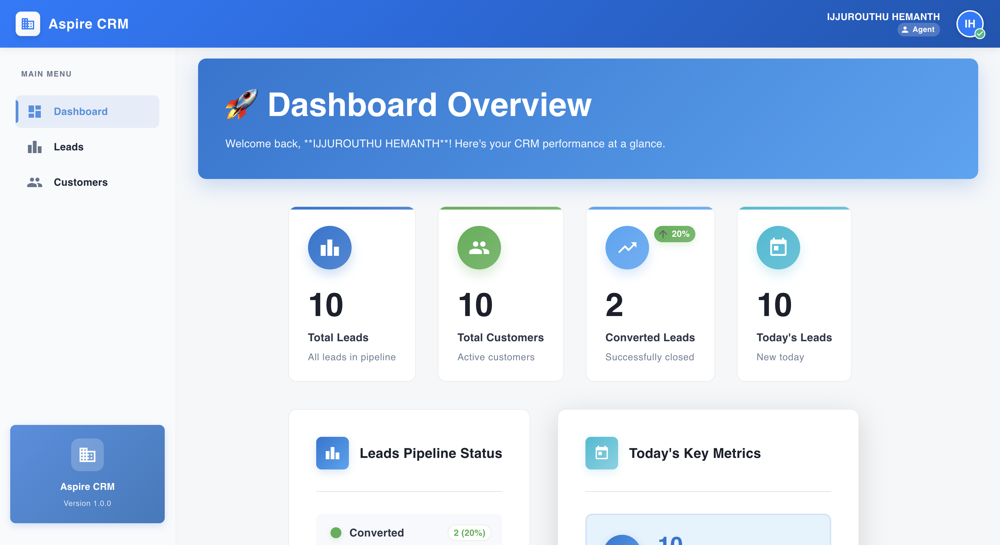
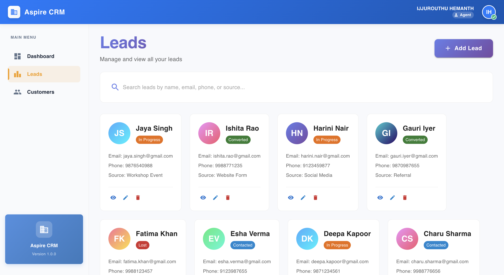
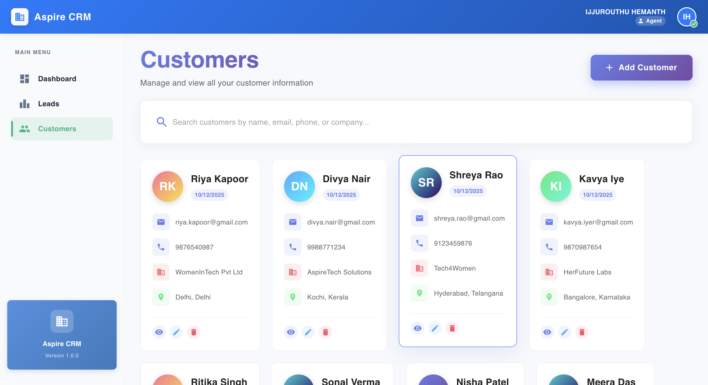
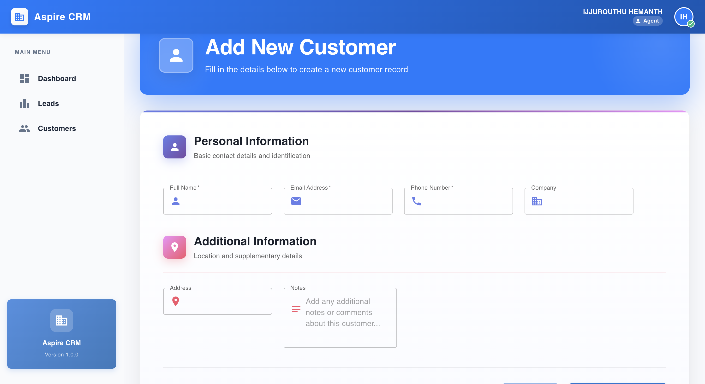

# 🌟 Aspire CRM: Full-Stack Customer Relationship Management

A modern, lightweight Customer & Leads Management System built using **MERN Stack** (MongoDB, Express, React, Node.js). Designed for businesses to manage leads, customers, authentication, and view performance on a real-time dashboard.

---

## 🔗 Live Application URLs

| Component | URL |
| :--- | :--- |
| **Live Demo** | [https://aspire-crm-mauve.vercel.app](https://aspire-crm-mauve.vercel.app) |

## 🚀 Key Features

* **🔐 Authentication & Authorization:**
    * Secure **JWT-based** login & signup.
    * **Role-based access** control (Admin/User).
    * Protected routes on both frontend & backend.

* **📊 Dashboard:**
    * Real-time stats for total leads, customers, and conversion rates.
    * Growth insights & key business metrics.
    * Fully responsive layout.
    
* **👥 Leads Management:**
    * **CRUD** operations (Add, update, delete, and track leads).
    * Manage lead status, source, and contact details.
    * Search & filter support.

* **🧑‍💼 Customers Management:**
    * Ability to **convert leads to customers**.
    * Full CRUD operations for customer profiles.
    * Tagging, categorization, and detailed profile information.

* **👨‍💻 User Management (Admin Only):**
    * Create and manage internal team members.
    * Role assignment and permission control.

* **🎨 Modern UI:**
    * Built with React + **Material UI (MUI)**.
    * Smooth animations and responsive design.
    * Clean, professional SaaS look and feel.

---

## 🛠️ Tech Stack

### Frontend

| Technology | Purpose |
| :--- | :--- |
| **React (Vite)** | Core library for building the user interface. |
| **Material UI (MUI)** | Component library for styling and modern design. |
| **Axios** | Promise-based HTTP client for API communication. |
| **React Router** | For declarative client-side routing. |

### Backend

| Technology | Purpose |
| :--- | :--- |
| **Node.js + Express.js** | Server-side runtime and web application framework. |
| **MongoDB + Mongoose** | NoSQL database and Object Data Modeling (ODM) library. |
| **JWT Authentication** | Secure token-based access control. |
| **CORS Enabled** | Handles cross-origin requests securely. |
| **Render Deployment** | Cloud platform for hosting the backend API. |

---

## 📁 Project Structure

A high-level overview of the project directory:

Aspire_CRM/ │ ├── backend/ │ ├── routes/ # API route definitions │ ├── controllers/ # Business logic │ ├── models/ # Mongoose schemas │ ├── middleware/ # Authentication and error handling │ ├── server.js # Server entry point │ └── .env # Environment variables (Backend) │ ├── frontend/ │ ├── src/ # React source files │ ├── public/ # Static assets │ ├── vite.config.js # Vite build configuration │ └── .env # Environment variables (Frontend) │ └── README.md

---

## ⚙️ Environment Variables

Create `.env` files in the respective directories and add these variables:

### Backend `.env`

### Frontend `.env`

---

## 🚀 Local Development Setup

Follow these steps to run the application on your local machine.

### 1️⃣ Clone the Repository

git clone [https://github.com/hemanthijjurouthu/Aspire_CRM.git](https://github.com/hemanthijjurouthu/Aspire_CRM.git)
cd Aspire_CRM

Backend Setup
Bash

cd backend
npm install
npm start

3️⃣ Frontend Setup
Bash

cd frontend
npm install
npm run dev

## 📡 API Endpoints

| Resource | Method | Endpoint | Description |
| :--- | :--- | :--- | :--- |
| **Auth** | `POST` | `/api/auth/register` | Create a new user account. |
| | `POST` | `/api/auth/login` | Authenticate and return JWT. |
| **Leads** | `GET` | `/api/leads` | Retrieve all leads. |
| | `POST` | `/api/leads` | Create a new lead. |
| | `PUT` | `/api/leads/:id` | Update an existing lead. |
| | `DELETE` | `/api/leads/:id` | Delete a lead. |
| **Customers** | `GET` | `/api/customers` | Retrieve all customers. |
| | `POST` | `/api/customers` | Create a new customer. |
| | `PUT` | `/api/customers/:id` | Update an existing customer. |
| | `DELETE` | `/api/customers/:id` | Delete a customer. |
| **Dashboard** | `GET` | `/api/dashboard/stats` | Get key statistics for the dashboard. |
| **Users** | `GET` | `/api/users` | Get all users (Admin only). |
| | `POST` | `/api/users` | Create a new user (Admin only). |

## 📸 Screenshots

### 🔐 Login Page

### 🏠 Dashboard

### 🎯 Leads Management

### 👤 Customers Page

### ➕ Add New Customer

## 🏆 Future Enhancements

* Email notifications for lead updates.
* Advanced Lead Pipelines visualization.
* Comprehensive Report Generation features.
* Detailed Activity Logs.
* Integrations (e.g., Google Maps, WhatsApp API, etc.).

---

## 💡 Author

* **IJJUROUTHU HEMANTH**
* **Email:** [hemanthijjurouthu@gmail.com](mailto:hemanthijjurouthu@gmail.com)
* **GitHub:** [https://github.com/hemanthijjurouthu](https://github.com/hemanthijjurouthu)

